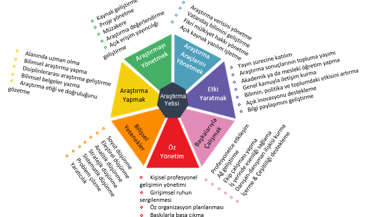

[<Return to Main Page](README.md)
 

Currently, FIRE Araştırma Eğitim Ltd. Şti. has two different categories in Research(er) Enhancement.

## Researcher Training (mostly based on European Competence Framework for Researchers)

Conventional training (graduate research and similar programs in undergraduate) unfortunately does not provide many skills, critical in both academic and other sectors. As a result, a European Competence Framework for Researchers was developed after several extensive works and expert opinions. 

ResearchComp is an excellent framework for the career development and skill improvement of current and prospective researchers.

-[The original EC Office of Publication document for ResearchComp](https://op.europa.eu/en/publication-detail/-/publication/5c8c86d8-3025-11ed-975d-01aa75ed71a1/language-en)

--[IFISR Turkish translation](https://drive.google.com/file/d/1-CfhhoyUoVkKf3YCi0aPGYr7kUZ-2dP3/view?usp=sharing)

-[The original independent expert report for ResearchComp](https://op.europa.eu/en/publication-detail/-/publication/8d536780-3025-11ed-975d-01aa75ed71a1)

--[IFISR Turkish translation for Annex-5, ResearchComp competence descriptions](https://drive.google.com/file/d/1c1SOQ4fhm9L-zjAlccOjdY5wbrkhV1qw/view?usp=drive_link)

 
FIRE Araştırma Eğitim Ltd. Şti. devises a training program for researchers and researcher candidate. It will be based on ResearchComp described above, and additional specific requirements decided after personal communications and expert judgments. More information will be provided as soon as it will be complete and ready for implementation.

## Research Enhancement

Research Enhancement will take place mainly in two ways, first one is provision of funds, the second one is teaching/suporting research studies with additional data, code, method, literature review, study, insight, and collaboration, and facilitate their research processes. One demo application of the latter case can be seen below:

[Data of Surface Water Quality in Türkiye](https://docs.google.com/document/d/18drToIuqP-8vUEdL0aGyy_iYfHkEw-oIp1Goz1osvus/edit?usp=sharing)

In this case, scattered and hard-to-reach surface water quality data from studies conducted in Türkiye was collected in Tables with important metadata regarding what is available. That public document is expected to give a direction/idea to the researchers interested in this topic, especially for Türkiye case, where unfortunately data availability is not sufficient.

One may also check the repositories of torna4o and fire-ae in github on finding useful codes for their studies. 
